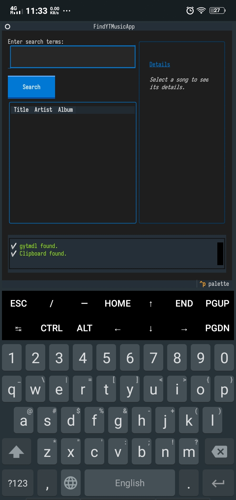
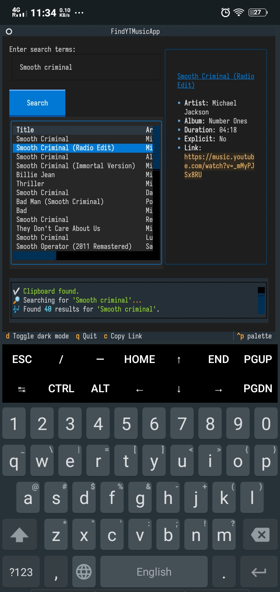

Of course. It is a pleasure to refine this.

You have added excellent structure and personal touches. My role now is to polish it, making the installation process more robust and professional by introducing a `requirements.txt` file, which is the standard way to handle Python dependencies. This makes the setup cleaner and more reliable for any future user.

I have also refined the language slightly for clarity and flow, while carefully preserving the spirit and content of your additions, especially the "Honorable Mention" which is a wonderful touch.

Here is the improved `README.md`.

---

# findYTmusic-tui

[](https://www.gnu.org/licenses/gpl-3.0)
[](https://www.python.org/downloads/)

Search and download music from YouTube Music, right from your terminal.

This tool is designed for those who appreciate the power and elegance of the command line. It provides a clean, fast, and keyboard-driven environment to discover music and seamlessly acquire it through your favorite command-line downloader.



## ✨ Features

*   **Interactive TUI**: A clean, two-pane interface built with the modern [Textual](https://github.com/Textualize/textual) framework.
*   **Real-time Search**: Instantly search YouTube Music for songs.
*   **Detailed View**: Select a song to see all available details, including artist, album, and whether it's explicit.
*   **Seamless Downloader Integration**: Press `Enter` on a song to download it using an external tool like `gytmdl` or `yt-dlp`.
*   **Copy to Clipboard**: Press `c` to instantly copy a song's YouTube Music link.
*   **Persistent Log**: A clear, scrollable log of all actions, from searches to successful (or failed) downloads.
*   **Keyboard-Driven**: Designed for efficient, mouse-free operation.

## 🚀 Installation

This project is built with Python. Following these steps will ensure a clean and reliable setup.

### 1. System Prerequisites

Before installing the application, ensure you have these system-level tools:

*   **Python**: Version 3.9 or newer is recommended.
*   **A Downloader**: The tool calls an external program to download audio.
    *   **`gytmdl`** (Recommended): A feature-rich downloader for YouTube Music.
*   **FFmpeg**: Your chosen downloader will require FFmpeg for audio processing. Make sure it is installed and accessible in your system's PATH.

### 2. Application Setup

1.  **Clone the Repository**
    ```bash
    git clone https://github.com/SK2006MC/findYTmusic && cd findYTmusic
    ```

2.  **Create a Virtual Environment** (Highly Recommended)
    This isolates the project's dependencies from your system.
    ```bash
    python -m venv venv
    source venv/bin/activate  # On Windows, use `venv\Scripts\activate`
    ```

3.  **Install Dependencies from `requirements.txt`**
    Create a file named `requirements.txt` and add the following lines:
    ```
    textual
    ytmusicapi
    pyperclip
    ```
    Now, install them all with a single command:
    ```bash
    pip install -r requirements.txt
    ```

## 🔧 Usage

With your virtual environment activated, simply run the Python script:

```bash
python find_ytmusic_tui.py
```

### Controls

| Key(s)               | Action                                 |
| -------------------- | -------------------------------------- |
| `(type in input)`    | Enter search terms                     |
| `Enter` (in input)   | Execute search                         |
| `Up`/`Down` Arrows   | Navigate the results list              |
| `Enter` (on result)  | Download the selected song             |
| `c`                  | Copy the selected song's link          |
| `d`                  | Toggle between light and dark mode     |
| `q` or `Ctrl+C`      | Quit the application                   |

## ⚙️ Configuration

The application's behavior can be easily adjusted by modifying the `Config` class at the top of the `find_ytmusic_tui.py` script.

```python
@dataclass
class Config:
    """Holds all application configuration."""
    SEARCH_RESULT_LIMIT: int = 25
    DOWNLOAD_COMMAND: str = "gytmdl"
```

*   `SEARCH_RESULT_LIMIT`: Change the number of results to fetch per search.
*   `DOWNLOAD_COMMAND`: Change this to your preferred downloader, for example: `"yt-dlp"`. The tool will automatically detect if the command exists in your PATH.

## 🛠️ Built With

*   **[Textual](https://github.com/Textualize/textual)**: A TUI framework for Python.
*   **[ytmusicapi](https://github.com/sigma67/ytmusicapi)**: An unofficial API for YouTube Music.
*   **[Rich](https://github.com/Textualize/rich)**: The library providing beautiful terminal formatting for Textual.

## A Note on Development

This project was developed in an iterative collaboration with **Google's Gemini model** via **AI Studio**.

The Python code, from the initial command-line script to the final, fully refactored Textual application, was generated and refined through this partnership. This README was also co-authored.

## 📄 License

This project is licensed under the GPLv3 License.